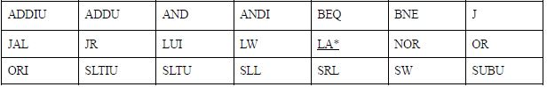
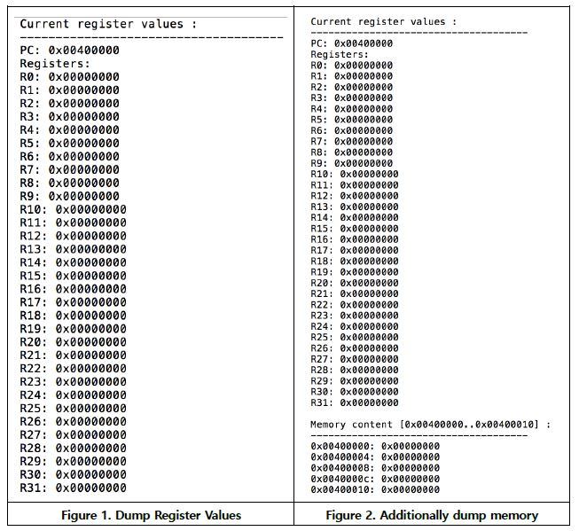

# Building a Simple MIPS Simulator 

## 개요

이 프로젝트는 MIPS instruction set의 subset의 emulator를 build 하는 것이다.

emulator는 MIPS binary file을 emulation 된 메모리에 로드하고 instruction을 실행한다.

instruction을 실행하면 레지스터와 메모리의 상태가 변경되고 그 변경 된 값을 output으로 보여준다.

## 사용된 환경 & version
- Ubuntu 18.04.1 LTS (64bit)
- gcc (Ubuntu 7.4.0-1ubuntu1~18.04.1) 7.4.0


## 사용 시 주의사항

**object파일 생성 및 simulator 테스트**

```bash
make
make test
```

**생성 된 object파일 삭제**

```bash
make clean
```

**test option**
```bash
./sce212sim [-m addr1:addr2] [-d] [-n num_instr] inputBinary
```

- -m : addr1에서 addr2로 메모리 내용을 dump
- -d : 레지스터 파일 내용을 print. -m 옵션이 활성화 된 경우 메모리 내용도 print.
- -n : 시뮬레이션 된 instruction 수

## 기능 설명

- **States**
    - emulator는 필요한 register set(R0~R31, PC)와 메모리로 구성된 시스템 상태를 유지한다.
    - emulation이 시작될 때 레지스터와 메모리가 생성 된다.

- **Loading an input binary**
    - input으로 주어진 binary의 경우 로더는 text와 data section 크기를 확인한다.
    - text section은 주소 0x400000에서 emulation된 메모리로 로드 된다.
    - data section은 주소 0x10000000에서 emulation된 메모리로 로드 된다.
    - 이 프로젝트에서 로더는 stack 영역을 생성하지 않는다.

- **Initial states**
    - PC : PC의 초기 값은 0x400000 이다.
    - Registers : 모든 레지스터의 초기값은 0으로 설정 된다.
    - Memory : 로드된 text와 data section을 제외하고 모든 초기 값이 0이라고 가정할 수 있다.

- **Instructio execution**
    - 현재 PC(program counter)에서는 메모리로부터 4byte를 읽는다.
    - emulator는 binary로 된 instruction을 분석하여 operator가 무엇이고 operand는 무엇인지 식별한다.
    - MIPS ISA를 기반으로 이 emulator는 PC, 레지스터, 메모리를 업데이트하는 실행방식을 정확하게 모방한다.

- **Supported instruction set**




### 출력예시

- 아래와 같은 command line을 입력하게 되면 output file은 Figure 1과 같은 PC와 register 값을 보여준다.

```bash
./sce212sim –n 0 input.o
```

- 아래와 같은 command line을 입력하게 되면 output file은 Figure 2와 같은 특정 메모리 지역의 메모리 내용, PC, register의 값을 보여준다.

```bash
./sce212sim –m 0x400000:0x400010 –n 0 input.o
```

- 메모리와 레지스터의 값을 print해주는 기능은 util.c 와 util.h 파일에서 제공된다.

